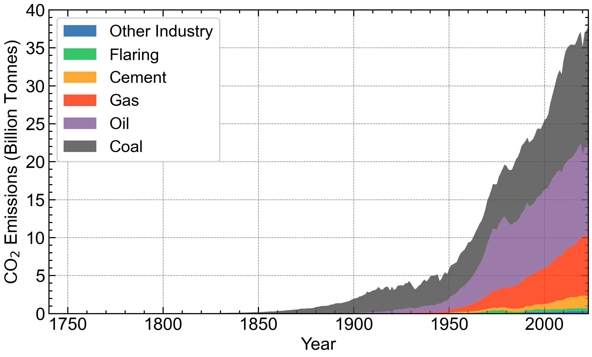

# co2-emission-graph
Visualizing global CO₂ emissions from various sources
# 📊 Aesthetic CO₂ Emission Graphs with Python

This project visualizes global CO₂ emissions from various industrial and fuel sources using a **stacked area graph** built in Python. The visualization uses Matplotlib with the `SciencePlots` style for a professional, publication-ready look.



---

## 📁 Project Contents

- `CO2_Emission_Graphs.ipynb` – Jupyter Notebook with data import, processing, and visualization code.
- `co2 emi.csv` – Dataset containing annual CO₂ emissions by source (coal, oil, gas, etc.).
- `CO2_fuelsemission.png` – Output figure generated by the code.
- `requirements.txt` – List of Python packages needed to run the notebook.

---

## ▶️ How to Run

### Step 1: Clone the Repository
```bash
git clone https://github.com/yourusername/aesthetic-co2-graphs.git
cd aesthetic-co2-graphs

Step 2: Install Dependencies
Install basic packages:

bash
Copy
Edit
pip install -r requirements.txt
Note: One of the libraries used is not on PyPI. You must install it from GitHub:

bash
Copy
Edit
python -m pip install git+https://github.com/garrettj403/SciencePlots.git
Step 3: Launch the Notebook
bash
Copy
Edit
jupyter notebook CO2_Emission_Graphs.ipynb
📊 Output Graph Features
📌 Stacked area plot showing contribution from Coal, Oil, Gas, Cement, Flaring, and Other Industries.

🎨 Styled using SciencePlots with science, notebook, and grid.

🖋️ LaTeX-like axis labels (CO₂, etc.) for clarity.

📁 Exported as a high-resolution transparent PNG.

📦 Dependencies
Install all with:

bash
Copy
Edit
pip install -r requirements.txt
requirements.txt contents:
txt
Copy
Edit
matplotlib
pandas
numpy
git+https://github.com/garrettj403/SciencePlots.git
💡 Inspiration
The goal of this notebook is to show how clean, well-styled scientific figures can be easily generated using Python. This is especially useful for:

Academic publications

Climate science communication

Teaching and educational materials

### ✅ Notes
- Replace `yourusername` in the GitHub link if you're putting it on GitHub.
- Replace `[Your Name]` with your name or GitHub handle.
